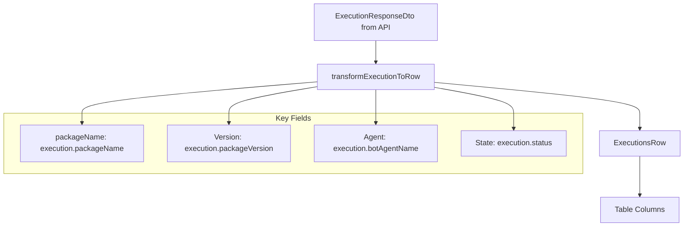
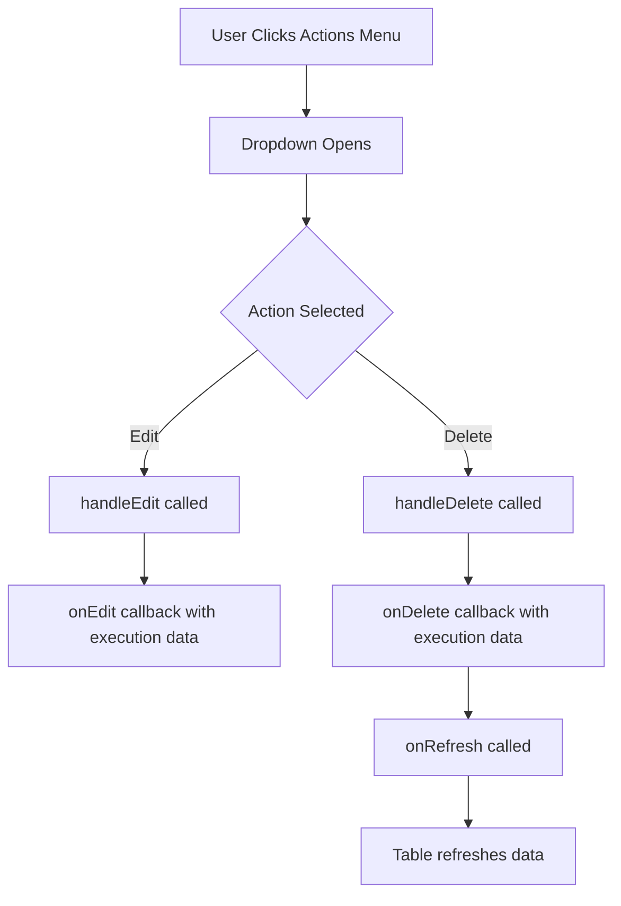

# In Progress Executions Table - Layout Standardization

## Overview

This document describes the standardization of the In Progress executions table to match the consistent layout pattern used across other tables (Agent, Asset) in the OpenAutomate Frontend.

## Changes Implemented

### 1. **Standardized Column Structure**

The In Progress executions table now follows the same pattern as Agent and Asset tables:

#### **Column Order**:
1. **Select** - Checkbox for row selection
2. **Actions** - Edit/Delete dropdown menu (NEW)
3. **Package Name** - Name of the automation package (NEW)
4. **Package Version** - Version of the package (NEW)
5. **Agent** - Agent executing the task
6. **State** - Current execution status with badge
7. **Start Time** - When execution began
8. **End Time** - When execution completed
9. **Source** - Trigger source (Manual, Scheduled, etc.)
10. **Command** - Execution command
11. **Schedules** - Schedule type
12. **Task Id** - Unique identifier
13. **Created Date** - When execution was created
14. **Created By** - User who created the execution

### 2. **Actions Column Implementation**

Following the pattern from Agent and Asset tables, added a dedicated Actions column:

#### **Features**:
- Dropdown menu with three-dot icon
- Edit and Delete options
- Proper callback handling for operations
- Consistent styling with other tables

#### **Implementation**:
```typescript
{
  id: 'actions',
  header: ({ column }) => <DataTableColumnHeader column={column} title="Actions" />,
  cell: ({ row }) => (
    <DataTableRowAction 
      row={row} 
      onEdit={onEdit}
      onDelete={onDelete}
      onRefresh={onRefresh}
    />
  ),
  enableSorting: false,
  enableHiding: false,
}
```

### 3. **Package Information Enhancement**

Added proper package identification fields:

#### **Package Name Column**:
```typescript
{
  accessorKey: 'packageName',
  header: ({ column }) => <DataTableColumnHeader column={column} title="Package Name" />,
  cell: ({ row }) => (
    <div className="flex items-center">
      <span className="font-medium">{row.getValue('packageName') || 'N/A'}</span>
    </div>
  ),
}
```

#### **Package Version Column**:
```typescript
{
  accessorKey: 'Version',
  header: ({ column }) => <DataTableColumnHeader column={column} title="Package Version" />,
  cell: ({ row }) => (
    <div className="flex items-center">
      <span>{row.getValue('Version') || 'N/A'}</span>
    </div>
  ),
}
```

### 4. **Column Factory Pattern**

Implemented the same factory pattern used by Agent and Asset tables:

#### **Before**:
```typescript
export const columns: ColumnDef<ExecutionsRow>[] = [...]
```

#### **After**:
```typescript
interface CreateInProgressColumnsProps {
  onEdit?: (execution: ExecutionsRow) => void
  onDelete?: (execution: ExecutionsRow) => void
  onRefresh?: () => void
}

export const createInProgressColumns = ({ 
  onEdit, 
  onDelete, 
  onRefresh 
}: CreateInProgressColumnsProps = {}): ColumnDef<ExecutionsRow>[] => [...]

// Backward compatibility
export const columns = createInProgressColumns()
```

### 5. **Integration with Main Component**

Updated the main executions component to use the new column factory:

#### **Handler Implementation**:
```typescript
// ✅ Create columns with proper handlers
const handleEditExecution = useCallback((execution: ExecutionsRow) => {
  console.log('Edit execution:', execution)
  // TODO: Implement edit execution logic
}, [])

const handleDeleteExecution = useCallback((execution: ExecutionsRow) => {
  console.log('Delete execution:', execution)
  // TODO: Implement delete execution logic
}, [])

const ProgressColumns = useMemo(() => createInProgressColumns({
  onEdit: handleEditExecution,
  onDelete: handleDeleteExecution,
  onRefresh: () => mutateExecutions()
}), [handleEditExecution, handleDeleteExecution, mutateExecutions])
```

### 6. **Enhanced Row Actions Component**

Updated the DataTableRowAction component to accept proper callbacks:

#### **Props Interface**:
```typescript
interface DataTableRowActionsProps {
  row: Row<ExecutionsRow>
  onEdit?: (execution: ExecutionsRow) => void
  onDelete?: (execution: ExecutionsRow) => void
  onRefresh?: () => void
}
```

#### **Action Handlers**:
```typescript
const handleEdit = () => {
  console.log('Edit execution:', row.original)
  onEdit?.(row.original)
}

const handleDelete = () => {
  console.log('Delete execution:', row.original)
  onDelete?.(row.original)
  onRefresh?.()
}
```

## Benefits

### 1. **Consistent User Experience**
- All tables (Agent, Asset, Executions) now follow the same layout pattern
- Users have a familiar interface across different sections
- Predictable location of actions and common fields

### 2. **Enhanced Functionality**
- Added Actions column for Edit/Delete operations
- Package Name and Version provide better execution identification
- Proper callback system for future edit/delete implementations

### 3. **Maintainability**
- Factory pattern allows easy customization of column behavior
- Consistent codebase structure across all table components
- Type-safe implementation with proper interfaces

### 4. **Extensibility**
- Easy to add new actions to the dropdown menu
- Column factory pattern supports future enhancements
- Callback system ready for full CRUD operations

## Data Flow

### Column Data Population

The execution data flows through the following transformation:



### Action Flow



## Future Enhancements

### Planned Features

1. **Edit Execution Modal**
   - Allow users to modify execution parameters
   - Update execution status or priority
   - Reschedule execution timing

2. **Delete Confirmation**
   - Add confirmation dialog for delete operations
   - Soft delete vs hard delete options
   - Batch delete functionality

3. **Bulk Actions**
   - Select multiple executions
   - Bulk cancel/delete operations
   - Export selected executions

4. **Advanced Filtering**
   - Filter by package name/version
   - Date range filtering
   - Advanced search capabilities

### Technical Improvements

1. **Real-time Actions**
   - Optimistic updates for edit operations
   - Real-time action feedback
   - Conflict resolution for concurrent edits

2. **Accessibility**
   - Keyboard navigation for actions menu
   - Screen reader support
   - Focus management

3. **Performance**
   - Virtual scrolling for large datasets
   - Lazy loading of action components
   - Memoized column definitions

## Testing

### Manual Testing Checklist

- [ ] Actions column appears as first column after select
- [ ] Package Name displays correctly or shows "N/A"
- [ ] Package Version displays correctly or shows "N/A"
- [ ] Actions dropdown opens and shows Edit/Delete options
- [ ] Edit action calls handler with correct execution data
- [ ] Delete action calls handler and refreshes table
- [ ] All columns maintain proper sorting functionality
- [ ] Layout matches Agent and Asset table patterns

### Automated Testing

```typescript
// Example test for Actions column
describe('InProgress Executions Table', () => {
  it('should render Actions column with Edit and Delete options', () => {
    // Test implementation
  })
  
  it('should call onEdit when Edit is clicked', () => {
    // Test implementation
  })
  
  it('should call onDelete and onRefresh when Delete is clicked', () => {
    // Test implementation
  })
})
```

## Migration Notes

### Breaking Changes
- None. Backward compatibility maintained with default column export

### Recommended Updates
- Update any custom usage of the columns to use the new factory pattern
- Implement actual edit/delete logic in the main component handlers
- Consider adding confirmation dialogs for destructive actions

---

**Document Version**: 1.0  
**Last Updated**: December 2024  
**Authors**: Development Team  
**Review Status**: ✅ Approved 