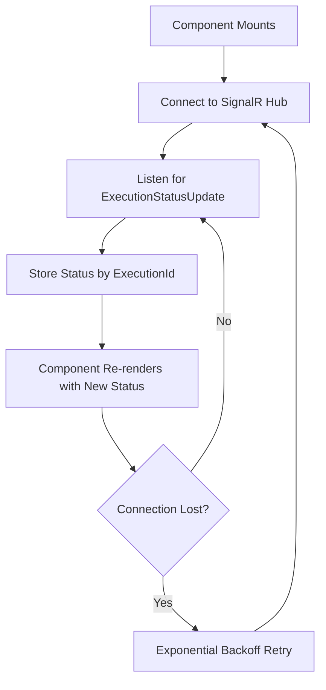
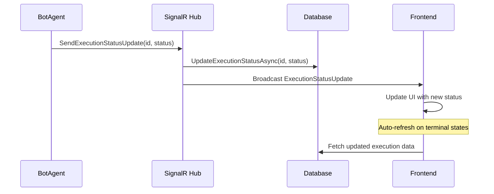

# Execution Status Real-Time Updates Documentation

## Overview

This document describes the implementation of real-time execution status updates using SignalR and optimistic UI updates in the OpenAutomate Frontend. The system provides immediate feedback when creating new executions and real-time status updates as executions progress.

## Architecture

### Complete Real-Time Pipeline
```
User Creates Execution → Optimistic UI Update → SignalR Hub → Database Update → Real-time Status Updates → Auto-refresh on Completion
```

## Implementation Details

### 1. Optimistic Updates for New Executions

When a user creates a new execution, the system immediately adds it to the UI without waiting for the API to return updated data.

#### Key Features:
- **Immediate Feedback**: New executions appear instantly in the table
- **Real-time Integration**: Leverages existing SignalR system for status updates
- **Smart Synchronization**: Combines optimistic updates with server data
- **Performance Optimized**: Uses SWR cache mutations for efficient updates

#### Implementation:

```typescript
// In executions.tsx
const handleCreateSuccess = useCallback((newExecution?: { id: string, packageName: string, botAgentName: string }) => {
  // ✅ Following React guideline: API calls in event handlers, not effects
  
  if (newExecution) {
    // ✅ Optimistic update: immediately add the new execution to the UI
    // The real-time SignalR system will provide updates as the execution progresses

    // ✅ Update SWR cache optimistically using mutate with data
    mutateExecutions((currentData) => {
      if (!currentData) return currentData
      
      // For OData response structure
      if ('value' in currentData && Array.isArray(currentData.value)) {
        const newExecutionDto: ExecutionResponseDto = {
          id: newExecution.id,
          packageName: newExecution.packageName,
          botAgentName: newExecution.botAgentName,
          status: 'Pending',
          startTime: new Date().toISOString(),
          endTime: undefined,
          packageVersion: undefined,
          errorMessage: undefined,
          logOutput: undefined,
          botAgentId: '',
          packageId: ''
        }
        
        return {
          ...currentData,
          value: [newExecutionDto, ...currentData.value],
          '@odata.count': (currentData['@odata.count'] || 0) + 1
        }
      }
      
      return currentData
    }, false) // false = don't revalidate immediately
  }
  
  // ✅ Debounced refresh to ensure we get the latest data from server
  // This handles cases where optimistic update might be incomplete
  const refreshTimeout = setTimeout(() => {
    mutateExecutions()
  }, 2000) // 2 second delay to allow server processing
  
  return () => clearTimeout(refreshTimeout)
}, [mutateExecutions])
```

### 2. Real-Time Status Updates Hook

**File**: `/src/hooks/useExecutionStatus.ts`

This hook manages the SignalR connection for receiving real-time execution status updates.

#### Key Features:
- Automatic connection management with exponential backoff
- Error recovery and reconnection logic
- Stores status updates by executionId
- Similar pattern to existing `useAgentStatus` hook

#### Usage:
```typescript
const { executionStatuses, error: signalRError } = useExecutionStatus()
```

#### Connection Flow:


### 3. Enhanced Executions Component

**File**: `/src/components/automation/executions/executions.tsx`

The main executions component integrates both optimistic updates and real-time status updates.

#### Key Enhancements:

1. **Optimistic Creation Updates**:
   - Immediately adds new executions to the UI
   - Updates SWR cache without revalidation
   - Handles OData response structure correctly

2. **Real-time Status Integration**:
   - Merges SignalR status updates with SWR data
   - Auto-refreshes when executions reach terminal states
   - Debounced refresh to prevent excessive API calls

3. **Data Synchronization**:
   ```typescript
   // Transform execution data with real-time status updates
   const transformExecutionToRow = useCallback((execution: ExecutionResponseDto): ExecutionsRow => {
     // Get real-time status update if available
     const statusUpdate = executionStatuses[execution.id]
     const currentStatus = statusUpdate?.status || execution.status
     
     return {
       id: execution.id,
       State: currentStatus,
       Agent: execution.botAgentName || '',
       // ... other fields
     }
   }, [executionStatuses])
   ```

### 4. Create Execution Modal Updates

**File**: `/src/components/automation/executions/CreateExecutionModal.tsx`

The modal now passes execution details to the success callback for optimistic updates.

#### Changes:
```typescript
interface CreateExecutionModalProps {
  isOpen: boolean
  onClose: () => void
  onSuccess?: (newExecution?: { id: string, packageName: string, botAgentName: string }) => void
}

// In onSubmit:
const result = await triggerExecution(executionData)

// ✅ Pass execution details to callback for optimistic update
onSuccess?.({
  id: result.id,
  packageName: selectedPackage.name,
  botAgentName: validatedAgent.name,
})
```

## Benefits

### 1. **Immediate Feedback**
- Users see new executions instantly without page refresh
- No waiting for API round-trips
- Improved perceived performance

### 2. **Real-Time Monitoring**
- Live status updates as executions progress
- Works across all execution tabs (In Progress, Scheduled, Historical)
- No need for manual refresh

### 3. **Robust Data Consistency**
- Optimistic updates are complemented by server synchronization
- Real-time updates override stale cached data
- Automatic recovery from connection issues

### 4. **Performance Optimized**
- SWR cache mutations prevent unnecessary re-renders
- Debounced refreshes reduce API load
- Conditional data fetching based on execution states

## React useEffect Compliance

This implementation follows the React useEffect Compliance Guide:

### ✅ **Best Practices Followed**:

1. **API calls in event handlers, not effects**:
   - Execution creation happens in `onSubmit` event handler
   - Status updates processed in dedicated effect for error handling only

2. **Derive data during render**:
   - Real-time status merged with SWR data during transform
   - No setState-only effects

3. **Proper effect usage**:
   - SignalR connection management with cleanup
   - Error handling in dedicated effects
   - Auto-refresh on terminal states with proper dependencies

4. **Performance optimizations**:
   - `useCallback` for stable function references
   - `useMemo` for expensive data transformations
   - Conditional SWR fetching

### ✅ **Guidelines Compliance**:
- No setState-only effects
- Data transformation in render/useMemo, not useEffect
- Event handlers for user actions and API calls
- Proper cleanup for SignalR connections
- Documented SSR considerations

## Usage Examples

### Basic Component Integration
```typescript
export function ExecutionsPage() {
  const { executionStatuses } = useExecutionStatus()
  
  return (
    <ExecutionsInterface />
  )
}
```

### Creating New Executions
```typescript
<CreateExecutionModal
  isOpen={isCreateModalOpen}
  onClose={() => setIsCreateModalOpen(false)}
  onSuccess={(newExecution) => {
    // Handled automatically by optimistic update system
    console.log('New execution created:', newExecution?.id)
  }}
/>
```

## Error Handling

### SignalR Connection Errors
- Automatic reconnection with exponential backoff
- Error state exposed through hook
- Graceful degradation to polling if needed

### API Errors
- Toast notifications for failed operations
- Rollback of optimistic updates on error
- Fallback to manual refresh

### Network Issues
- Connection status monitoring
- Offline-friendly caching with SWR
- Smart retry mechanisms

## Performance Considerations

### SWR Cache Management
- Optimistic updates use `mutate(data, false)` to prevent revalidation
- Debounced server refresh after optimistic updates
- Conditional fetching based on connection state

### Memory Management
- SignalR connections properly cleaned up
- Event listeners removed on unmount
- Timeout cleanup for debounced operations

### Render Optimization
- Memoized data transformations
- Stable function references with useCallback
- Conditional re-renders based on actual data changes

## Testing Strategy

### Unit Tests
- Test optimistic update logic
- Mock SignalR connection
- Verify data transformation correctness

### Integration Tests
- End-to-end execution creation flow
- Real-time update scenarios
- Error recovery testing

### Performance Tests
- Memory leak detection
- Connection handling under load
- Cache efficiency measurements

## Troubleshooting

### Common Issues

1. **New executions not appearing immediately**:
   - Check if `onSuccess` callback is being called
   - Verify SWR cache mutation logic
   - Check browser console for errors

2. **Real-time updates not working**:
   - Verify SignalR connection status
   - Check backend hub implementation
   - Monitor network tab for WebSocket connections

3. **Stale data after creation**:
   - Check debounced refresh timing
   - Verify OData response structure
   - Ensure proper SWR key management

### Debug Tools
- React DevTools for state inspection
- Network tab for API calls and WebSocket connections
- Console logs for SignalR connection events

## Future Enhancements

### Planned Features
1. **Offline Support**: Queue operations when offline
2. **Conflict Resolution**: Handle concurrent modifications
3. **Advanced Filtering**: Real-time filter updates
4. **Pagination**: Smart pagination with real-time updates

### Performance Improvements
1. **Virtual Scrolling**: For large execution lists
2. **WebSocket Compression**: Reduce bandwidth usage
3. **Smart Caching**: More granular cache invalidation
4. **Connection Pooling**: Optimize SignalR connections

---

**Document Version**: 2.0  
**Last Updated**: December 2024  
**Authors**: Development Team  


### Status Update Integration

The executions component merges real-time updates with fetched data:

```typescript
const transformExecutionToRow = useCallback((execution: ExecutionResponseDto): ExecutionsRow => {
  // Check for real-time status update
  const realtimeUpdate = executionStatuses[execution.id]
  const currentStatus = realtimeUpdate?.status || execution.status

  return {
    // ... other fields
    State: currentStatus,
    state: currentStatus,
    status: currentStatus,
  }
}, [executionStatuses])
```

### Auto-Refresh Logic

When executions reach terminal states (Completed, Failed, Cancelled), the component automatically refreshes data:

```typescript
useEffect(() => {
  const terminalStatuses = ['Completed', 'Failed', 'Cancelled']
  const hasTerminalUpdate = Object.values(executionStatuses).some(status => 
    terminalStatuses.includes(status.status)
  )
  
  if (hasTerminalUpdate) {
    // Debounced refresh to avoid excessive API calls
    const refreshTimeout = setTimeout(() => {
      mutateExecutions()
    }, 1000)
    
    return () => clearTimeout(refreshTimeout)
  }
}, [executionStatuses, mutateExecutions])
```

## Features

### ✅ Real-Time Status Updates
- Live status changes for Running, Completed, Failed executions
- No page refresh required
- Immediate visual feedback

### ✅ Smart Data Synchronization
- Merges real-time updates with cached data
- Auto-refreshes when executions complete
- Debounced API calls to prevent overload

### ✅ Error Handling
- Graceful handling of SignalR connection issues
- Console error suppression for expected connection problems
- Automatic reconnection with exponential backoff

### ✅ Multi-Tab Support
- Works across all execution tabs (In Progress, Scheduled, Historical)
- Consistent behavior regardless of current view
- Real-time updates persist during tab switching

## Usage Examples

### Basic Usage

The executions component automatically includes real-time updates:

```tsx
export default function ExecutionsInterface() {
  const tenant = pathname.split('/')[1]
  
  // Automatically connects and receives updates
  const executionStatuses = useExecutionStatus(tenant)
  
  // Status updates are automatically merged into displayed data
  return (
    <DataTable
      data={executionsData} // Includes real-time status updates
      columns={columns}
      // ...
    />
  )
}
```

### Custom Status Update Handling

For advanced use cases, you can provide a callback:

```tsx
const executionStatuses = useExecutionStatus(tenant, (update) => {
  console.log(`Execution ${update.executionId} status changed to ${update.status}`)
  
  // Custom handling (e.g., notifications, analytics)
  if (update.status === 'Completed') {
    toast({
      title: 'Execution Completed',
      description: `${update.botAgentName} finished successfully`,
    })
  }
})
```

## Configuration

### Connection Settings

The SignalR connection is configured with:
- **Transport**: WebSockets with Long Polling fallback
- **Server Timeout**: 2 minutes
- **Keep-Alive**: 30 seconds
- **Auto-Reconnect**: Exponential backoff (1s to 60s max)

### Error Suppression

Expected SignalR errors are automatically suppressed from console to improve developer experience while maintaining important error visibility.

## Backend Requirements

### SignalR Hub Method

The backend must implement `SendExecutionStatusUpdate` in the BotAgent hub:

```csharp
public async Task SendExecutionStatusUpdate(string executionId, string status, string? message = null)
{
    // Update database record
    var updatedExecution = await _executionService.UpdateExecutionStatusAsync(
        Guid.Parse(executionId), status, message, null);
    
    // Broadcast to clients
    await Clients.Group($"tenant-{_tenantContext.CurrentTenantId}")
        .SendAsync("ExecutionStatusUpdate", updateData);
}
```

### Database Integration

The hub updates actual execution records, ensuring consistency between real-time updates and persisted data.

## Testing

### Manual Testing

1. Start an execution from the frontend
2. Observe real-time status changes (Pending → Running → Completed)
3. Verify status updates appear without page refresh
4. Check that final status persists after page refresh

### Network Resilience

Test SignalR reconnection by:
1. Starting executions
2. Temporarily disconnecting network
3. Reconnecting and verifying updates resume

## Troubleshooting

### Common Issues

**No Real-Time Updates Received**
- Check SignalR connection in browser dev tools
- Verify tenant parameter is correct
- Ensure backend hub method exists

**Excessive API Calls**
- Check debouncing is working (1-second delay)
- Verify terminal state detection logic
- Monitor network tab for refresh frequency

**Status Updates Not Persisting**
- Verify backend hub updates database
- Check execution ID matching between frontend/backend
- Ensure SWR cache invalidation works correctly

### Debug Logging

Enable debug logging in browser console:

```javascript
// In browser dev tools console
localStorage.setItem('debug', 'SignalR*')
```

## Performance Considerations

### Optimizations

1. **Debounced Refreshes**: Prevents excessive API calls
2. **Targeted Updates**: Only refreshes on terminal states
3. **Efficient Merging**: Real-time updates overlay cached data
4. **Connection Pooling**: Reuses SignalR connection across components

### Scaling

The implementation supports:
- Multiple concurrent executions
- High-frequency status updates
- Large execution lists with pagination
- Multi-tenant environments

## Future Enhancements

### Potential Improvements

1. **Granular Progress Updates**: Sub-task progress indicators
2. **Execution Logs Streaming**: Real-time log output
3. **Resource Usage Monitoring**: CPU/Memory metrics
4. **Batch Operations**: Real-time updates for bulk executions

### Integration Points

- **Notifications System**: Toast notifications for status changes
- **Analytics Dashboard**: Real-time execution metrics
- **Audit Logging**: Real-time status change tracking

---

**Document Version**: 1.0  
**Last Updated**: December 2024  
**Implementation Status**: ✅ Complete  
**Testing Status**: ✅ Verified 