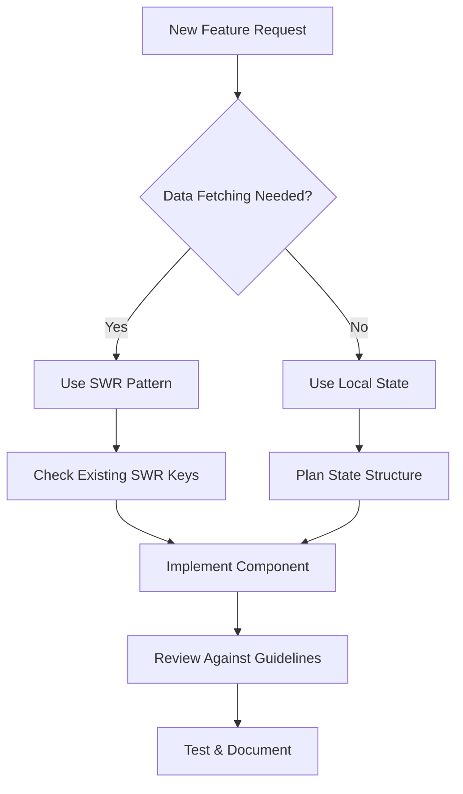

# 🚀 React useEffect Compliance Guide for New Features

## 📖 Table of Contents

1. [Quick Start Checklist](#quick-start-checklist)
2. [Development Workflow](#development-workflow)
3. [Component Patterns](#component-patterns)
4. [Data Fetching Guidelines](#data-fetching-guidelines)
5. [Common Scenarios & Solutions](#common-scenarios--solutions)
6. [Code Review Checklist](#code-review-checklist)
7. [Examples & Templates](#examples--templates)
8. [Troubleshooting](#troubleshooting)

---

## ✅ Quick Start Checklist

Before writing any new component or feature, ask yourself:

### **🎯 The Golden Questions**

1. **Can I derive this data during render instead of storing it in state?**
2. **Does this useEffect only call setState? (If yes, eliminate it!)**
3. **Should this API call be in an event handler instead of useEffect?**
4. **Can I use a dynamic `key` to reset component state?**
5. **Am I using SWR for data fetching?**

### **📋 Pre-Development Checklist**

- [ ] Read this guide completely
- [ ] Check existing patterns in the codebase
- [ ] Plan your data flow before coding
- [ ] Identify if you need SWR or local state
- [ ] Consider component lifecycle and cleanup

---

## 🔄 Development Workflow

### **Step 1: Plan Your Component**



### **Step 2: Choose the Right Pattern**

| Scenario              | Pattern                | Example                          |
| --------------------- | ---------------------- | -------------------------------- |
| **API Data Fetching** | SWR                    | User lists, executions, roles    |
| **Form State**        | useState + dynamic key | Create/edit modals               |
| **UI State**          | useState               | Modal open/close, tabs           |
| **Computed Values**   | useMemo                | Filtered lists, calculations     |
| **Event Handlers**    | useCallback            | Click handlers, form submissions |

---

## 🧩 Component Patterns

### **Pattern 1: Data Fetching Component**

✅ **DO: Use SWR for all API data**

```typescript
'use client'

import useSWR from 'swr'
import { swrKeys } from '@/lib/swr-config'
import { getUsersApi } from '@/lib/api/users'

export function UsersList() {
  // ✅ SWR for data fetching
  const { data: users, error, isLoading, mutate } = useSWR(
    swrKeys.users(),
    getUsersApi.getAll
  )

  // ✅ Transform data during render (Guideline #1)
  const activeUsers = useMemo(() =>
    users?.filter(user => user.isActive) ?? [],
    [users]
  )

  // ✅ Error handling in dedicated effect (Guideline #3)
  useEffect(() => {
    if (error) {
      toast({
        title: 'Error',
        description: 'Failed to load users',
        variant: 'destructive',
      })
    }
  }, [error])

  // ✅ Event handlers for user actions (Guideline #3)
  const handleCreateUser = async (userData: CreateUserDto) => {
    try {
      await getUsersApi.create(userData)
      toast({ title: 'Success', description: 'User created' })
      mutate() // ✅ Refresh cache
    } catch (error) {
      toast({ title: 'Error', description: 'Failed to create user' })
    }
  }

  return (
    <div>
      {isLoading && <LoadingSpinner />}
      {activeUsers.map(user => (
        <UserCard key={user.id} user={user} />
      ))}
      <CreateUserButton onClick={handleCreateUser} />
    </div>
  )
}
```

❌ **DON'T: Manual data fetching**

```typescript
// ❌ Don't do this anymore!
export function UsersList() {
  const [users, setUsers] = useState([])
  const [loading, setLoading] = useState(true)

  useEffect(() => {
    const fetchUsers = async () => {
      setLoading(true)
      try {
        const data = await getUsersApi.getAll()
        setUsers(data)
      } catch (error) {
        // Error handling mixed with data fetching
      } finally {
        setLoading(false)
      }
    }
    fetchUsers()
  }, []) // Manual dependency management
}
```

### **Pattern 2: Form/Modal Component**

✅ **DO: Use dynamic keys for state reset**

```typescript
// Parent Component
export function UsersPage() {
  const [editingUser, setEditingUser] = useState<User | null>(null)
  const [isModalOpen, setIsModalOpen] = useState(false)

  return (
    <>
      <UsersList onEdit={setEditingUser} />

      {/* ✅ Dynamic key resets component state */}
      <CreateEditUserModal
        key={editingUser?.id ?? 'new'}
        isOpen={isModalOpen}
        editingUser={editingUser}
        onClose={() => {
          setIsModalOpen(false)
          setEditingUser(null)
        }}
      />
    </>
  )
}

// Modal Component
export function CreateEditUserModal({ editingUser, isOpen, onClose }) {
  // ✅ Initialize state based on props (reset via key)
  const [name, setName] = useState(editingUser?.name ?? '')
  const [email, setEmail] = useState(editingUser?.email ?? '')

  // ✅ No useEffect needed for state reset!

  return (
    <Dialog open={isOpen} onOpenChange={onClose}>
      {/* Form content */}
    </Dialog>
  )
}
```

❌ **DON'T: setState-only effects**

```typescript
// ❌ Don't do this!
export function CreateEditUserModal({ editingUser }) {
  const [name, setName] = useState('')
  const [email, setEmail] = useState('')

  // ❌ setState-only effect - eliminate this!
  useEffect(() => {
    if (editingUser) {
      setName(editingUser.name)
      setEmail(editingUser.email)
    } else {
      setName('')
      setEmail('')
    }
  }, [editingUser])
}
```

### **Pattern 3: Computed Values**

✅ **DO: Derive data during render**

```typescript
export function ProductsList() {
  const { data: products } = useSWR(swrKeys.products(), getProducts)
  const [searchTerm, setSearchTerm] = useState('')
  const [category, setCategory] = useState('all')

  // ✅ Derive filtered data during render
  const filteredProducts = useMemo(() => {
    if (!products) return []

    return products
      .filter(product =>
        product.name.toLowerCase().includes(searchTerm.toLowerCase())
      )
      .filter(product =>
        category === 'all' || product.category === category
      )
  }, [products, searchTerm, category])

  // ✅ Derive categories during render
  const availableCategories = useMemo(() => {
    if (!products) return []
    return [...new Set(products.map(p => p.category))]
  }, [products])

  return (
    <div>
      <SearchInput value={searchTerm} onChange={setSearchTerm} />
      <CategoryFilter
        categories={availableCategories}
        selected={category}
        onChange={setCategory}
      />
      <ProductGrid products={filteredProducts} />
    </div>
  )
}
```

❌ **DON'T: Store derived data in state**

```typescript
// ❌ Don't do this!
export function ProductsList() {
  const [products, setProducts] = useState([])
  const [filteredProducts, setFilteredProducts] = useState([]) // ❌ Derived state
  const [searchTerm, setSearchTerm] = useState('')

  // ❌ Effect only for setState
  useEffect(() => {
    const filtered = products.filter((product) =>
      product.name.toLowerCase().includes(searchTerm.toLowerCase()),
    )
    setFilteredProducts(filtered)
  }, [products, searchTerm])
}
```

---

## 📡 Data Fetching Guidelines

### **When to Use SWR**

✅ **Always use SWR for:**

- API data fetching
- Server state management
- Data that needs caching
- Data shared across components
- Background revalidation needs

### **SWR Implementation Checklist**

```typescript
// ✅ Complete SWR implementation template
export function MyComponent() {
  // 1. Use existing SWR keys
  const { data, error, isLoading, mutate } = useSWR(
    swrKeys.myResource(), // ✅ Use centralized keys
    myApi.getAll
  )

  // 2. Handle loading state
  if (isLoading) return <LoadingSpinner />

  // 3. Transform data during render
  const processedData = useMemo(() => {
    return data?.map(transformItem) ?? []
  }, [data])

  // 4. Handle errors in dedicated effect
  useEffect(() => {
    if (error) {
      toast(createErrorToast(error))
    }
  }, [error])

  // 5. Mutations in event handlers
  const handleCreate = async (newItem) => {
    try {
      await myApi.create(newItem)
      mutate() // ✅ Refresh cache
    } catch (error) {
      toast(createErrorToast(error))
    }
  }

  return <div>{/* Component JSX */}</div>
}
```

### **Adding New SWR Keys**

When adding new API endpoints, update the SWR keys:

```typescript
// src/lib/swr-config.ts
export const swrKeys = {
  // Existing keys...

  // ✅ Add your new keys here
  users: () => ['users'] as const,
  userById: (id: string) => ['users', id] as const,
  userRoles: (userId: string) => ['users', userId, 'roles'] as const,

  // For filtered/parameterized data
  usersByRole: (role: string) => ['users', 'by-role', role] as const,
}
```

---

## 🎯 Common Scenarios & Solutions

### **Scenario 1: Master-Detail View**

```typescript
// ✅ Good: Separate SWR calls for list and detail
export function UsersPage() {
  const [selectedUserId, setSelectedUserId] = useState<string | null>(null)

  return (
    <div className="flex">
      <UsersList onSelect={setSelectedUserId} />
      {selectedUserId && (
        <UserDetail
          key={selectedUserId} // ✅ Reset detail when user changes
          userId={selectedUserId}
        />
      )}
    </div>
  )
}

export function UserDetail({ userId }: { userId: string }) {
  // ✅ Separate SWR call for detail data
  const { data: user, error, isLoading } = useSWR(
    swrKeys.userById(userId),
    () => getUsersApi.getById(userId)
  )

  // Component implementation...
}
```

### **Scenario 2: Dependent Data Fetching**

```typescript
export function UserRoles({ userId }: { userId: string }) {
  // ✅ First fetch user data
  const { data: user } = useSWR(
    swrKeys.userById(userId),
    () => getUsersApi.getById(userId)
  )

  // ✅ Conditional fetch based on user data
  const { data: roles } = useSWR(
    user?.isActive ? swrKeys.userRoles(userId) : null, // ✅ Conditional key
    () => getUsersApi.getRoles(userId)
  )

  return <div>{/* Component JSX */}</div>
}
```

### **Scenario 3: Form with API Data**

```typescript
export function EditUserForm({ userId }: { userId: string }) {
  // ✅ Fetch user data with SWR
  const { data: user, mutate } = useSWR(
    swrKeys.userById(userId),
    () => getUsersApi.getById(userId)
  )

  // ✅ Initialize form with fetched data
  const form = useForm({
    defaultValues: {
      name: user?.name ?? '',
      email: user?.email ?? '',
    }
  })

  // ✅ Reset form when user data changes
  useEffect(() => {
    if (user) {
      form.reset({
        name: user.name,
        email: user.email,
      })
    }
  }, [user, form])

  const onSubmit = async (data) => {
    try {
      await getUsersApi.update(userId, data)
      mutate() // ✅ Update cache
      toast({ title: 'Success' })
    } catch (error) {
      toast(createErrorToast(error))
    }
  }

  return <form onSubmit={form.handleSubmit(onSubmit)}>{/* Form JSX */}</form>
}
```

### **Scenario 4: Real-time Updates**

```typescript
export function NotificationsList() {
  const { data: notifications, mutate } = useSWR(
    swrKeys.notifications(),
    getNotifications
  )

  // ✅ WebSocket or polling for real-time updates
  useEffect(() => {
    const interval = setInterval(() => {
      mutate() // ✅ Refresh data periodically
    }, 30000) // Every 30 seconds

    return () => clearInterval(interval) // ✅ Cleanup
  }, [mutate])

  return <div>{/* Component JSX */}</div>
}
```

---

## 📝 Code Review Checklist

### **For Reviewers**

When reviewing new features, check for:

#### **✅ SWR Usage**

- [ ] Uses SWR for all API data fetching
- [ ] Uses existing SWR keys or adds new ones properly
- [ ] Handles loading and error states
- [ ] Uses `mutate()` for cache invalidation

#### **✅ useEffect Compliance**

- [ ] No setState-only effects
- [ ] Data transformation in render/useMemo, not useEffect
- [ ] Error handling in dedicated effects
- [ ] Proper cleanup for DOM effects
- [ ] SSR documentation for client-only effects

#### **✅ Component Patterns**

- [ ] Dynamic keys for form/modal state reset
- [ ] Event handlers for user actions
- [ ] Proper dependency arrays
- [ ] No suppressed ESLint warnings

#### **✅ Performance**

- [ ] useMemo for expensive calculations
- [ ] useCallback for stable function references
- [ ] Conditional SWR fetching when appropriate

### **Common Review Comments**

```typescript
// ❌ Review comment: "Use SWR instead of manual fetching"
useEffect(() => {
  fetchData()
}, [])

// ❌ Review comment: "Eliminate setState-only effect, use dynamic key"
useEffect(() => {
  if (editingItem) {
    setName(editingItem.name)
  }
}, [editingItem])

// ❌ Review comment: "Move data transformation to useMemo"
useEffect(() => {
  const filtered = data.filter((item) => item.active)
  setFilteredData(filtered)
}, [data])

// ❌ Review comment: "Move API call to event handler"
useEffect(() => {
  if (shouldSubmit) {
    submitForm()
  }
}, [shouldSubmit])
```

---

## 📚 Examples & Templates

### **Template 1: Basic List Component**

```typescript
'use client'

import { useState, useMemo, useEffect } from 'react'
import useSWR from 'swr'
import { swrKeys } from '@/lib/swr-config'
import { useToast } from '@/components/ui/use-toast'
import { createErrorToast } from '@/lib/utils/error-utils'

interface MyListComponentProps {
  // Define your props
}

export function MyListComponent({ }: MyListComponentProps) {
  const { toast } = useToast()

  // ✅ SWR for data fetching
  const { data: items, error, isLoading, mutate } = useSWR(
    swrKeys.myItems(),
    myApi.getAll
  )

  // ✅ Local UI state
  const [searchTerm, setSearchTerm] = useState('')
  const [selectedItems, setSelectedItems] = useState<string[]>([])

  // ✅ Derived data during render
  const filteredItems = useMemo(() => {
    if (!items) return []
    return items.filter(item =>
      item.name.toLowerCase().includes(searchTerm.toLowerCase())
    )
  }, [items, searchTerm])

  // ✅ Error handling
  useEffect(() => {
    if (error) {
      toast(createErrorToast(error))
    }
  }, [error, toast])

  // ✅ Event handlers
  const handleCreate = async (newItem: CreateItemDto) => {
    try {
      await myApi.create(newItem)
      toast({ title: 'Success', description: 'Item created' })
      mutate() // Refresh cache
    } catch (error) {
      toast(createErrorToast(error))
    }
  }

  const handleDelete = async (itemId: string) => {
    try {
      await myApi.delete(itemId)
      toast({ title: 'Success', description: 'Item deleted' })
      mutate() // Refresh cache
    } catch (error) {
      toast(createErrorToast(error))
    }
  }

  if (isLoading) {
    return <div>Loading...</div>
  }

  return (
    <div>
      <SearchInput value={searchTerm} onChange={setSearchTerm} />
      <CreateButton onClick={handleCreate} />

      <div className="grid gap-4">
        {filteredItems.map(item => (
          <ItemCard
            key={item.id}
            item={item}
            onDelete={() => handleDelete(item.id)}
            selected={selectedItems.includes(item.id)}
            onSelect={(selected) => {
              if (selected) {
                setSelectedItems(prev => [...prev, item.id])
              } else {
                setSelectedItems(prev => prev.filter(id => id !== item.id))
              }
            }}
          />
        ))}
      </div>
    </div>
  )
}
```

### **Template 2: Create/Edit Modal**

```typescript
'use client'

import { useState } from 'react'
import { useForm } from 'react-hook-form'
import { zodResolver } from '@hookform/resolvers/zod'
import * as z from 'zod'

const formSchema = z.object({
  name: z.string().min(1, 'Name is required'),
  description: z.string().optional(),
})

type FormData = z.infer<typeof formSchema>

interface CreateEditModalProps {
  isOpen: boolean
  onClose: (shouldRefresh?: boolean) => void
  editingItem?: MyItem | null
}

export function CreateEditModal({
  isOpen,
  onClose,
  editingItem
}: CreateEditModalProps) {
  const { toast } = useToast()
  const [isSubmitting, setIsSubmitting] = useState(false)

  // ✅ Initialize form with editing data (reset via key prop in parent)
  const form = useForm<FormData>({
    resolver: zodResolver(formSchema),
    defaultValues: {
      name: editingItem?.name ?? '',
      description: editingItem?.description ?? '',
    }
  })

  const onSubmit = async (data: FormData) => {
    setIsSubmitting(true)
    try {
      if (editingItem) {
        await myApi.update(editingItem.id, data)
        toast({ title: 'Success', description: 'Item updated' })
      } else {
        await myApi.create(data)
        toast({ title: 'Success', description: 'Item created' })
      }
      onClose(true) // ✅ Signal parent to refresh
    } catch (error) {
      toast(createErrorToast(error))
    } finally {
      setIsSubmitting(false)
    }
  }

  return (
    <Dialog open={isOpen} onOpenChange={() => onClose()}>
      <DialogContent>
        <DialogHeader>
          <DialogTitle>
            {editingItem ? 'Edit Item' : 'Create Item'}
          </DialogTitle>
        </DialogHeader>

        <Form {...form}>
          <form onSubmit={form.handleSubmit(onSubmit)} className="space-y-4">
            <FormField
              control={form.control}
              name="name"
              render={({ field }) => (
                <FormItem>
                  <FormLabel>Name</FormLabel>
                  <FormControl>
                    <Input {...field} />
                  </FormControl>
                  <FormMessage />
                </FormItem>
              )}
            />

            <FormField
              control={form.control}
              name="description"
              render={({ field }) => (
                <FormItem>
                  <FormLabel>Description</FormLabel>
                  <FormControl>
                    <Textarea {...field} />
                  </FormControl>
                  <FormMessage />
                </FormItem>
              )}
            />

            <DialogFooter>
              <Button type="button" variant="outline" onClick={() => onClose()}>
                Cancel
              </Button>
              <Button type="submit" disabled={isSubmitting}>
                {isSubmitting ? 'Saving...' : (editingItem ? 'Update' : 'Create')}
              </Button>
            </DialogFooter>
          </form>
        </Form>
      </DialogContent>
    </Dialog>
  )
}
```

---

## 🔧 Troubleshooting

### **Common Issues & Quick Fixes**

#### **1. "Cannot read properties of undefined"**

**Problem**: Accessing data before SWR loads

```typescript
// ❌ Problem
const userName = data.user.name // Error if data is undefined

// ✅ Solution
const userName = data?.user?.name ?? 'Loading...'
```

#### **2. "Too many re-renders"**

**Problem**: Unstable dependencies in useEffect

```typescript
// ❌ Problem
useEffect(() => {
  // This object is recreated on every render
  fetchData({ filter: 'active' })
}, [{ filter: 'active' }])

// ✅ Solution
const filter = useMemo(() => ({ filter: 'active' }), [])
useEffect(() => {
  fetchData(filter)
}, [filter])
```

#### **3. "Stale closure in event handler"**

**Problem**: Event handler captures old state

```typescript
// ❌ Problem
const [count, setCount] = useState(0)
const handleClick = () => {
  setTimeout(() => {
    setCount(count + 1) // Uses stale count
  }, 1000)
}

// ✅ Solution
const handleClick = () => {
  setTimeout(() => {
    setCount((prev) => prev + 1) // Always current
  }, 1000)
}
```

#### **4. "SWR not refetching"**

**Problem**: SWR key not changing when it should

```typescript
// ❌ Problem
const { data } = useSWR('users', getUsers) // Static key

// ✅ Solution
const { data } = useSWR(
  swrKeys.usersByStatus(status), // Dynamic key
  () => getUsers(status),
)
```

### **Performance Tips**

1. **Use conditional SWR fetching**

   ```typescript
   const { data } = useSWR(shouldFetch ? swrKeys.data() : null, fetcher)
   ```

2. **Memoize expensive calculations**

   ```typescript
   const expensiveValue = useMemo(() => {
     return heavyCalculation(data)
   }, [data])
   ```

3. **Debounce search inputs**

   ```typescript
   const [searchTerm, setSearchTerm] = useState('')
   const debouncedSearch = useDebounce(searchTerm, 300)

   const { data } = useSWR(debouncedSearch ? swrKeys.search(debouncedSearch) : null, () =>
     searchApi(debouncedSearch),
   )
   ```

### **ESLint Configuration**

Add these rules to catch common issues:

```json
{
  "rules": {
    "react-hooks/exhaustive-deps": "error",
    "react-hooks/rules-of-hooks": "error",
    "@typescript-eslint/no-unused-vars": "error",
    "prefer-const": "error"
  }
}
```

---

## 🎯 Success Checklist

Before submitting your PR, ensure:

### **✅ Code Quality**

- [ ] No ESLint warnings or errors
- [ ] All useEffect hooks have proper dependencies
- [ ] No setState-only effects
- [ ] SWR used for all API calls
- [ ] Error handling implemented
- [ ] Loading states handled

### **✅ Performance**

- [ ] useMemo used for expensive calculations
- [ ] useCallback used for stable function references
- [ ] Conditional SWR fetching where appropriate
- [ ] No unnecessary re-renders

### **✅ User Experience**

- [ ] Loading states provide feedback
- [ ] Error messages are user-friendly
- [ ] Forms reset properly between create/edit
- [ ] Data refreshes after mutations

### **✅ Documentation**

- [ ] Complex logic is commented
- [ ] SSR effects are documented
- [ ] Component props are typed
- [ ] README updated if needed

---

## 📚 Additional Resources

### **Official Documentation**

- [SWR Documentation](https://swr.vercel.app/)
- [React useEffect Guide](https://react.dev/reference/react/useEffect)
- [React Performance](https://react.dev/learn/render-and-commit)

### **Team Resources**

- [Project useEffect Optimization Documentation](./React-useEffect-Optimization-Documentation.md)
- [Code Review Guidelines](../CODE_REVIEW.md)
- [API Documentation](../API.md)

### **VS Code Extensions**

- ES7+ React/Redux/React-Native snippets
- React Developer Tools
- TypeScript Importer

---

**Remember**: When in doubt, ask the team! We're here to help ensure code quality and consistency.

**Document Version**: 1.0
**Last Updated**: December 2024
**Authors**: Development Team
**Review Status**: ✅ Approved
